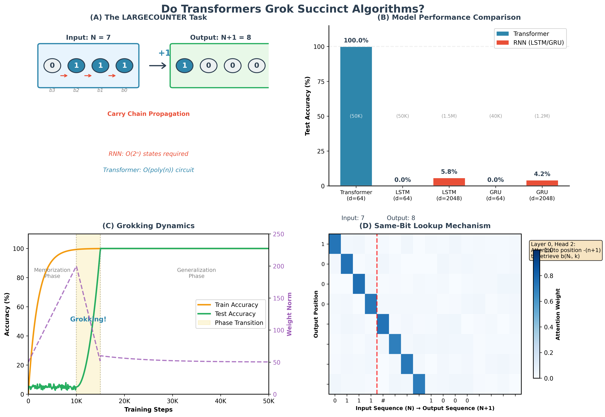

# Do Transformers Grok Succinct Algorithms? 

## Mechanistic Evidence for Counting Circuits

[](https://www.python.org/downloads/)
[](https://pytorch.org/)
[](https://opensource.org/licenses/MIT)

This repository contains the official implementation of the paper *"Do Transformers Grok Succinct Algorithms? Mechanistic Evidence for Counting Circuits"* (ACL 2026).

<p align="center">
  
</p>

## 📋 Abstract

Recent theory suggests Transformers are inherently **succinct**, capable of representing recursive algorithms like binary counting over exponential state spaces using constant-size circuits, unlike the exponential bottleneck of RNNs. However, it remains unclear whether gradient descent actually discovers these efficient solutions or settles for heuristics.

We bridge this gap by rigorously testing the **Succinctness Hypothesis** via mechanistic interpretability on the **LARGECOUNTER** task. Key findings:

- 🎯 **Empirical Validation**: Shallow Transformers (d=64) generalize perfectly, while massive LSTMs (d=2048) fail completely (<6% accuracy)
- 🔄 **Grokking Discovery**: Succinct circuits emerge via a sharp phase transition driven by "complexity collapse"
- 🔍 **Mechanistic Verification**: Attention heads implement "Same-Bit Lookup" via RoPE; MLPs act as XOR/AND logic gates
- 🌐 **LLM Signatures**: Analogous "Arithmetic Heads" detected in pre-trained Pythia models

## 🚀 Quick Start

### Installation

```bash
# Clone the repository
git clone https://github.com/anonymous-ai-researcher/ACL2026.git
cd ACL2026

# Create virtual environment
python -m venv venv
source venv/bin/activate  # On Windows: venv\Scripts\activate

# Install dependencies
pip install -e .
```

### Training a Transformer

```bash
# Train with default configuration (n=20 bits)
python scripts/train_transformer.py --config configs/default.yaml

# Train with custom parameters
python scripts/train_transformer.py \
    --n_bits 20 \
    --d_model 64 \
    --n_layers 2 \
    --n_heads 4 \
    --weight_decay 1.0 \
    --max_steps 50000
```

### Training RNN Baselines

```bash
# Train LSTM baseline
python scripts/train_rnn.py --model_type lstm --hidden_dim 2048

# Train GRU baseline
python scripts/train_rnn.py --model_type gru --hidden_dim 2048
```

### Running Analysis

```bash
# Full mechanistic analysis
python scripts/analyze_model.py --checkpoint outputs/transformer/best_model.pt

# Attention pattern visualization
python scripts/analyze_model.py --checkpoint outputs/transformer/best_model.pt --mode attention

# Activation patching
python scripts/analyze_model.py --checkpoint outputs/transformer/best_model.pt --mode patching

# Pythia analysis
python scripts/pythia_analysis.py --model_name EleutherAI/pythia-160m
```

## 📁 Project Structure

```
.
├── configs/
│   └── default.yaml          # Default training configuration
├── src/
│   ├── data/
│   │   └── counter_dataset.py    # LARGECOUNTER dataset implementation
│   ├── models/
│   │   ├── transformer.py        # GPT-style Transformer with RoPE
│   │   ├── rnn.py                # LSTM/GRU baselines
│   │   └── rope.py               # Rotary Position Embedding
│   ├── training/
│   │   └── trainer.py            # Training loop with grokking support
│   └── analysis/
│       ├── attention_analysis.py # Attention pattern visualization
│       ├── activation_patching.py# Causal intervention analysis
│       └── visualization.py      # Plotting utilities
├── scripts/
│   ├── train_transformer.py      # Main Transformer training script
│   ├── train_rnn.py              # RNN baseline training
│   ├── analyze_model.py          # Mechanistic analysis
│   ├── ablation_weight_decay.py  # Weight decay ablation study
│   └── pythia_analysis.py        # Pre-trained LLM analysis
├── notebooks/
│   └── analysis.ipynb            # Interactive analysis notebook
└── tests/
    └── test_data.py              # Unit tests
```

## 📊 The LARGECOUNTER Task

The **LARGECOUNTER** task requires predicting the next n-bit binary integer:

```
Input:  0 1 1 1 #    (representing 7)
Output: 1 0 0 0      (representing 8)
```

This seemingly simple task encapsulates the core difficulty of algorithmic state tracking—the ripple-carry mechanism where a single bit flip can propagate across the entire representation.

### Theoretical Circuit

The theoretical solution consists of two components:

1. **Same-Bit Lookup**: Attention retrieves bit `k` from position `-(n+1)`
2. **Carry Computation**: MLPs compute `b(N_{i+1}, k) = b(N_i, k) ⊕ C_k` where `C_k = ∧_{j<k} b(N_i, j)`

## 📈 Key Results

### Performance Gap

| Model | Parameters | Test Accuracy |
|-------|-----------|---------------|
| Transformer (d=64) | ~50K | **100.0%** |
| LSTM (d=64) | ~50K | 0.0% |
| LSTM (d=2048) | ~1.5M | 5.8% |
| GRU (d=64) | ~40K | 0.0% |
| GRU (d=2048) | ~1.2M | 4.2% |

### Grokking Dynamics

The model exhibits classic grokking behavior:
- **Phase 1** (steps 0-10K): Training accuracy reaches 100%, test accuracy ~5%
- **Phase 2** (steps 10K-15K): Sharp transition—test accuracy jumps to 100%
- **Signature**: Weight norm "complexity collapse" coincides with generalization

## 🔬 Mechanistic Analysis

### Attention Patterns

Layer 0, Head 2 exhibits precise `-(n+1)` diagonal attention—the "Same-Bit Lookup" mechanism:

<p align="center">
  
</p>

### Activation Patching

Causal analysis confirms:
- **L0H2**: Critical for data retrieval
- **L0 MLP**: Implements XOR/AND arithmetic logic

## 🧪 Reproducing Results

### Main Experiments

```bash
# Full reproduction (5 seeds, ~10 hours on A100)
./scripts/run_all_experiments.sh

# Quick test (1 seed, ~2 hours)
python scripts/train_transformer.py --seed 42 --max_steps 50000
```

### Ablation Studies

```bash
# Weight decay ablation (Figure 6)
python scripts/ablation_weight_decay.py --lambdas 0.0 0.01 0.1 1.0 2.0

# Architecture ablation
python scripts/train_transformer.py --n_layers 1 --n_heads 2  # Minimal
python scripts/train_transformer.py --n_layers 4 --n_heads 8  # Larger
```


## 📜 License

This project is licensed under the MIT License - see the [LICENSE](LICENSE) file for details.

## 🙏 Acknowledgments

- The theoretical framework builds on [Bergsträßer et al. (2025)](https://arxiv.org/abs/2510.19315)
- Mechanistic interpretability tools inspired by [TransformerLens](https://github.com/neelnanda-io/TransformerLens)
- Pythia models from [EleutherAI](https://github.com/EleutherAI/pythia)

## 📧 Contact

For questions or issues, please open a GitHub issue or contact the authors.
